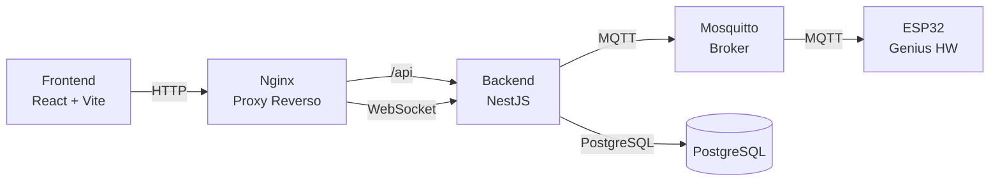
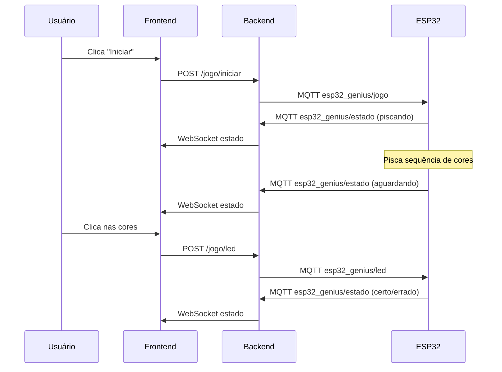

# Arquitetura

## Visão Geral

## Componentes

| Componente | Tecnologia | Função |
|------------|------------|--------|
| Frontend | React 19 + Vite + Bootstrap 5 | Interface do usuário |
| Backend | NestJS + Socket.IO | API e comunicação em tempo real |
| PostgreSQL | Alpine | Armazenamento de dados |
| Mosquitto | Eclipse Mosquitto | Broker MQTT |
| Nginx | Alpine | Proxy reverso |
| ESP32 | MicroPython | Hardware do jogo Genius |

## Fluxo do Jogo

## Redes Docker

Todos os serviços rodam na mesma rede Docker (`app_network`) e se comunicam pelo nome do serviço.
