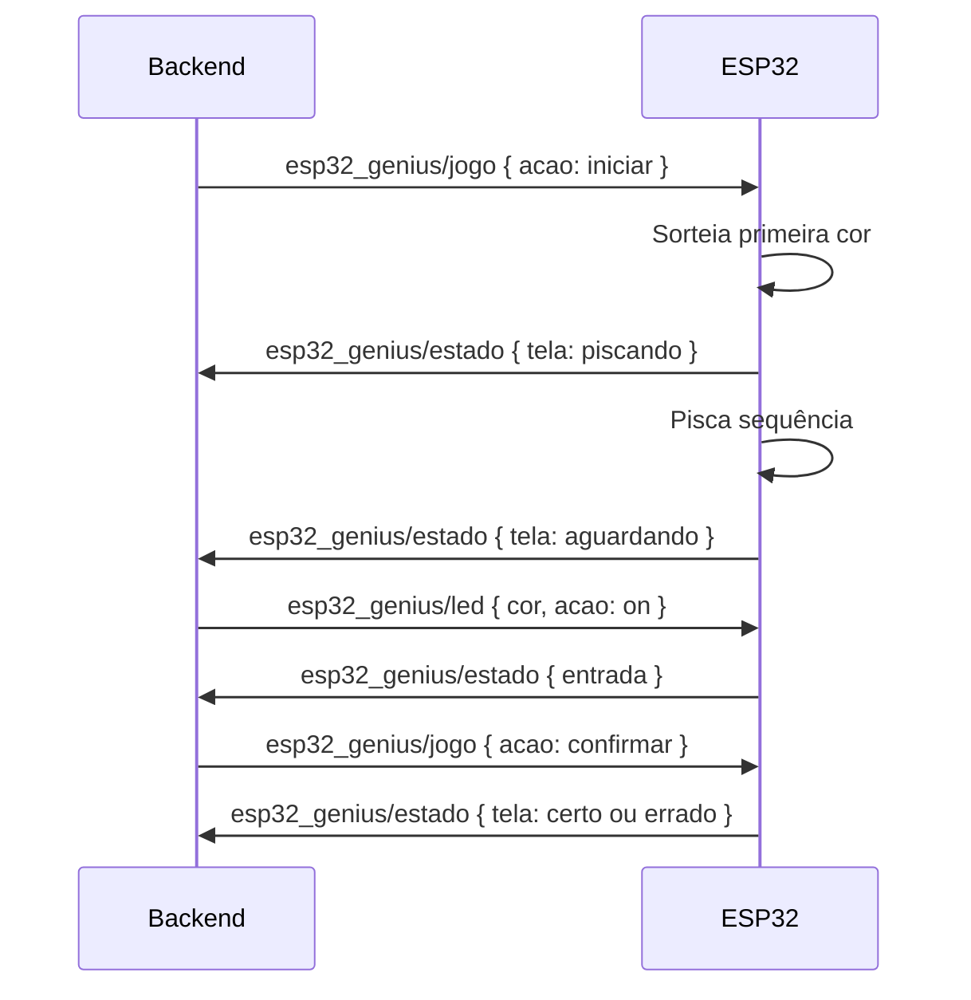

# Embarcado

Código MicroPython do ESP32 responsável por configurar a rede, conectar ao broker MQTT e executar a lógica física do jogo Genius.

## Estrutura

```
embarcado/
├── boot.py   # Configuração inicial, captive portal e Wi-Fi
└── main.py   # MQTT, LEDs e máquina de estados do jogo
```

## Visão Geral

O ESP32 trabalha em dois momentos:

| Arquivo | Função |
|---------|--------|
| `boot.py` | Garante que exista uma configuração de Wi-Fi/MQTT antes de iniciar o jogo |
| `main.py` | Conecta ao Wi-Fi, assina tópicos MQTT, controla os LEDs e publica o estado |

Se `config.json` não existir ou estiver inválido, o `boot.py` abre um Access Point para configuração. Depois que as credenciais são salvas, o dispositivo reinicia e o `main.py` usa esses dados para conectar à rede e ao broker.

## Configuração Inicial

Quando não existe `config.json`, o ESP32 inicia em modo Access Point:

| Campo | Valor |
|-------|-------|
| SSID | `ESP32_Setup` |
| Senha | `12345678` |
| IP | `192.168.4.1` |

O captive portal responde na porta `80` e usa um DNS falso na porta `53` para redirecionar requisições para a página de configuração.

Campos solicitados no formulário:

| Campo | Descrição |
|-------|-----------|
| SSID do Wi-Fi | Nome da rede local |
| Senha do Wi-Fi | Senha da rede local |
| IP do Broker MQTT | Endereço do Mosquitto |
| Porta do Broker | Porta MQTT, normalmente `1883` |

Após salvar, o `boot.py` grava `config.json` e reinicia o ESP32.

## config.json

Formato esperado pelo `main.py`:

```json
{
  "wifi_ssid": "MinhaRede",
  "wifi_pass": "senha",
  "broker_ip": "192.168.1.50",
  "broker_port": 1883
}
```

Se o Wi-Fi configurado falhar durante o boot, o dispositivo volta para o modo Access Point.

## Pinos dos LEDs

| Cor | GPIO |
|-----|------|
| Vermelho | `25` |
| Amarelo | `14` |
| Verde | `26` |
| Azul | `27` |

Todos os LEDs são inicializados apagados. O dicionário `LEDS` mapeia o nome da cor para o respectivo `Pin`.

## Tópicos MQTT

| Tópico | Direção | Função |
|--------|---------|--------|
| `esp32_genius/led` | Backend → ESP32 | Registra uma cor escolhida pelo jogador |
| `esp32_genius/jogo` | Backend → ESP32 | Recebe comandos de controle |
| `esp32_genius/estado` | ESP32 → Backend | Publica o estado atual da partida |
| `esp32_genius/status` | ESP32 → Backend | Publica presença e dados do dispositivo |

## Identificação do Dispositivo

Ao conectar ao broker, o ESP32 publica em `esp32_genius/status`:

```json
{
  "online": true,
  "nome": "esp32_genius",
  "marca": "Espressif",
  "modelo": "ESP32",
  "ip": "192.168.1.10"
}
```

O backend usa esses dados para atualizar a presença no frontend e persistir o dispositivo na tabela `embarcados`.

## Estado do Jogo

Estado interno mantido em `main.py`:

```python
estado = {
    'tela': 'inicio',
    'fase': 1,
    'sequencia': [],
    'entrada': [],
}
```

Payload publicado em `esp32_genius/estado`:

```json
{
  "tela": "aguardando",
  "fase": 3,
  "seq_len": 3,
  "entrada": ["vermelho", "azul"]
}
```

### Telas

| Tela | Descrição |
|------|-----------|
| `inicio` | Aguardando início da partida |
| `piscando` | Exibindo a sequência nos LEDs |
| `aguardando` | Aguardando a entrada do jogador |
| `certo` | Jogador acertou a sequência |
| `errado` | Jogador errou a sequência |

## Comandos Recebidos

### esp32_genius/led

```json
{
  "cor": "vermelho",
  "acao": "on"
}
```

O comando só é aceito quando `tela` está em `aguardando`. A cor precisa existir em `LEDS`, a ação precisa ser `on`, `1` ou `ligar`, e a entrada não pode estar completa.

Ao aceitar a cor, o ESP32:

1. Pisca o LED correspondente por feedback físico.
2. Adiciona a cor em `estado['entrada']`.
3. Publica o novo estado.

### esp32_genius/jogo

| Ação | Comportamento |
|------|---------------|
| `iniciar` | Cria a primeira sequência e começa a partida |
| `reiniciar` | Apaga LEDs, limpa estado e volta para `inicio` |
| `confirmar` | Compara `entrada` com `sequencia` |
| `cancelar` | Remove a última cor digitada |

O backend publica `iniciar`, `reiniciar` e `confirmar`. O embarcado também implementa `cancelar`, mas esse comando não é exposto nos endpoints atuais.

## Fluxo da Partida



Em caso de acerto, o ESP32 celebra, incrementa a fase, adiciona uma nova cor à sequência e exibe a sequência atualizada. Em caso de erro, sinaliza no LED vermelho, limpa a rodada e volta para `inicio`.

## Reconexão

O loop principal monitora Wi-Fi e MQTT continuamente.

| Condição | Ação |
|----------|------|
| Wi-Fi desconectado | Tenta reconectar à rede configurada |
| MQTT desconectado | Recria o cliente e assina os tópicos novamente |
| Erro de socket | Zera o cliente MQTT e tenta reconectar |

Depois de reconectar ao MQTT, o ESP32 publica novamente os dados de status e o estado atual.

## Fila de Comandos

As mensagens MQTT recebidas são colocadas em `fila_comandos` e processadas no loop principal. Isso evita executar lógica longa diretamente no callback MQTT.

Após ações que bloqueiam o loop com animações (`iniciar` e `confirmar`), o código descarta comandos de LED acumulados durante a animação. Assim, cliques antecipados do jogador não entram como jogadas válidas quando a tela volta para `aguardando`.
